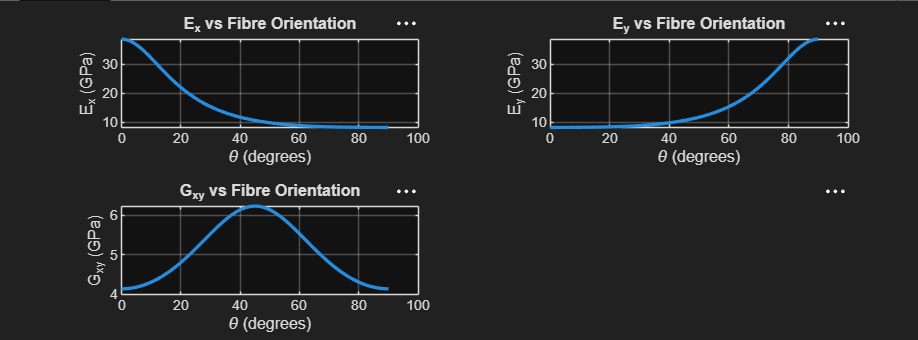

# Orthotropic Composite Lamina Transformed Properties Solver

A MATLAB application developed to analyze the macromechanical behavior of a unidirectional orthotropic composite lamina. The script calculates and simulates the variation of transformed engineering constants—Longitudinal Modulus ($E_x$), Transverse Modulus ($E_y$), and Shear Modulus ($G_{xy}$)—across a continuous fiber orientation angle sweep from $0^\circ$ to $90^\circ$.

---

## Technical Context & Material Transformations

Unidirectional composite laminae are inherently orthotropic, meaning their mechanical properties are highly directional. When structural loads do not align perfectly with the principal material axes (Longitudinal $L$ and Transverse $T$), the elastic properties must be transformed into the global coordinate system ($x, y$) using transformation tensors.

This script executes element-wise, vectorized computations to resolve these transformed engineering constants based on classical composite ply mechanics equations:

### 1. Global Longitudinal Modulus ($E_x$)
$$\frac{1}{E_x} = \frac{\cos^4\theta}{E_L} + \frac{\sin^4\theta}{E_T} + \left( \frac{1}{G_{LT}} - \frac{2\nu_{LT}}{E_L} \right) \sin^2\theta \cos^2\theta$$

### 2. Global Transverse Modulus ($E_y$)
$$\frac{1}{E_y} = \frac{\sin^4\theta}{E_L} + \frac{\cos^4\theta}{E_T} + \left( \frac{1}{G_{LT}} - \frac{2\nu_{LT}}{E_L} \right) \sin^2\theta \cos^2\theta$$

### 3. Global Shear Modulus ($G_{xy}$)
$$\frac{1}{G_{xy}} = 4\sin^2\theta \cos^2\theta \left( \frac{1}{E_L} + \frac{1}{E_T} + \frac{2\nu_{LT}}{E_L} \right) + \frac{(\cos^2\theta - \sin^2\theta)^2}{G_{LT}}$$

Where:
* $E_L, E_T$ are the principal longitudinal and transverse elastic moduli.
* $G_{LT}$ is the in-plane shear modulus, and $\nu_{LT}$ is the major Poisson's ratio.
* $\theta$ is the arbitrary fiber orientation angle relative to the global loading axis.

---

## Script Architecture & Performance Features

* **High-Density Angular Sweep:** Constructs an explicit, high-resolution array mapping angles from $0^\circ$ to $90^\circ$ at refined increments of $0.5^\circ$.
* **Vectorized Processing:** Replaces computationally expensive loops with highly optimized element-wise matrix operators (`./` and `.*`), ensuring instant convergence and plotting execution.
* **Tiled Visual Layout:** Uses MATLAB’s modern `tiledlayout` frame to cleanly stack individual dynamic plots side-by-side for rapid structural comparative analysis.

---

## How to Run & Input Parameters

1. Open `jatincomposteassignmentExEyExy.m` inside **MATLAB**.
2. Run the script and supply your principal ply properties in the command window when prompted.

### Sample Test Properties (Glass/Epoxy Lamina example):
* Longitudinal Modulus ($E_L$): `38.6` GPa
* Transverse Modulus ($E_T$): `8.27` GPa
* In-Plane Shear Modulus ($G_{LT}$): `4.14` GPa
* Major Poisson's Ratio ($\nu_{LT}$): `0.26`

The script will instantly output a multi-panel visual grid tracking exactly how your ply softens or stiffens as the fibers rotate away from the load direction.

- 
